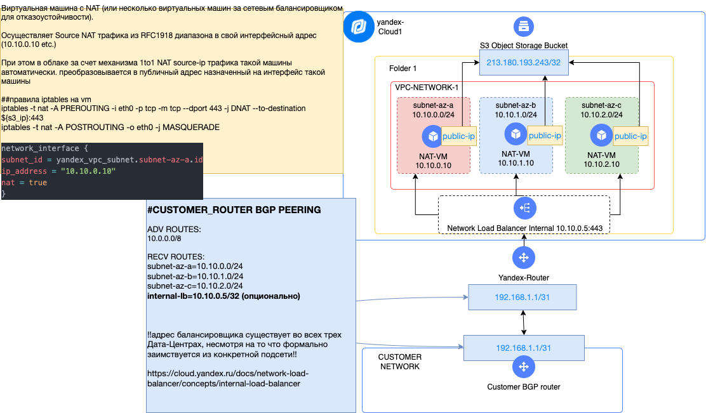

# Cценарий по настройке NATa для доступа к Yandex Cloud S3

Этот Terraform плейбук позволяет создать стенд для осуществления ната в S3 Yandex Cloud для Cloud Interconnect на основе внутреннего балансера и виртуальных машин c IPtables правилами.

## Установка YC-CLI

Для устанвки YC CLI можно использовать следующий гайд [YC CLI](https://cloud.yandex.ru/docs/cli/quickstart)


## Авторизация терраформ-провайдера через YC

```bash
export YC_TOKEN=$(yc iam create-token)
export YC_CLOUD_ID=$(yc config get cloud-id)
export YC_FOLDER_ID=$(yc config get folder-id)
```

## Схема решения

Плейбук разворачивает следующую инфраструктуру:



<br/>

## Развертывание плейбука

Для запуска создайте файл `terraform.tfvars` с переменными:

```hcl
# количество вм с натом, обычно для отказоустойчивости нужно 3 по одной в зоне доступности
node_count = 3
# преффикс к имени создаваемых ресурсов
name_preffix = "someprefix"
# SSH ключ для виртуальных машин
ssh_public_key = "ssh-rsa <ключ>"

# ID сети в которой будут создаваться подсети (если их ID не указаны в следующей переменной).
# Если переменная не указана, то будет создана новая сеть
network_id = "somenetworkid"
# Список ID подсетей, в которых будут создаваться виртуальные машины (для отказоустойчивости рекомендует 3, под одной в зоне доступности).
# Если не указана переменная, то будут созданы новые подсети.
subnet_ids = [
  "subnet1id",
  "subnet2id",
  "subnet3id"
]
```

#### Вызов терраформа

```bash
terraform init
terraform plan
terraform apply
```

## Удаляем инфраструктуру

```bash
terraform destroy
```
